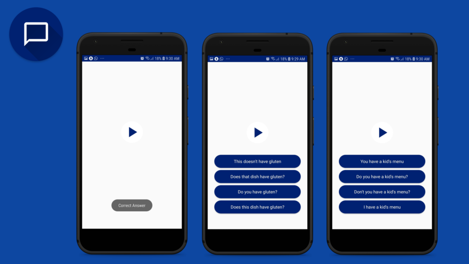

# Prouner
This is an application that aims provide a different and new tool to practice english, more precisely practice the listening skills.
It is achieved providing for the user a plenty of speeches, which the user will listen to, and then try to guess what was spoken, selecting an option.
The user will have several exercises to practice. Since this is the main and only achieve of this app, this is the best tool for the user who aims improve his listening skills.

## Tools

 - Architecture: MVP
 - Storage: Firebase Storage
 
# Demo    

 

# Contact me
 - E-mail: fernandohsbatista@gmail.com
 - LinkedIn: https://www.linkedin.com/in/fhsbatista/
